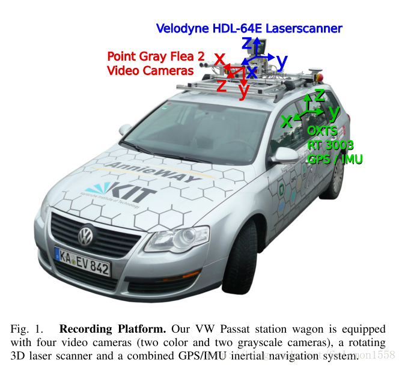
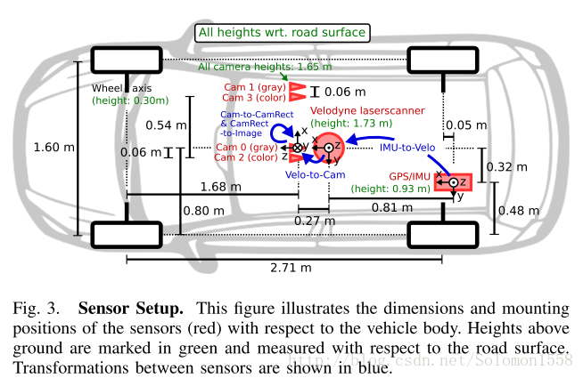
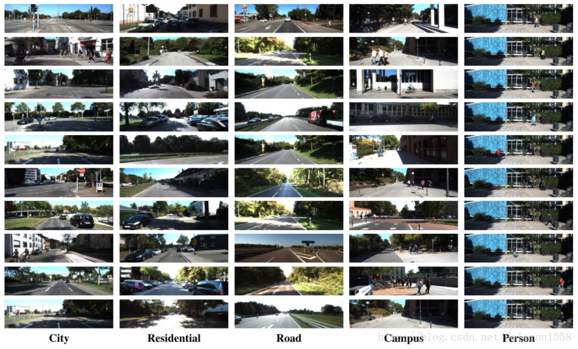
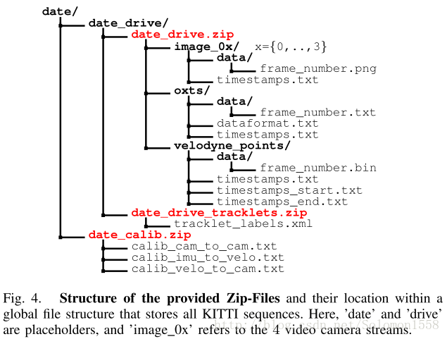

# KITTI数据集概述

　　KITTI数据集由德国卡尔斯鲁厄理工学院和丰田美国技术研究院联合创办，是目前国际上最大的自动驾驶场景下的计算机视觉算法评测数据集。该数据集用于评测**立体图像(stereo)，光流(optical flow)，视觉测距(visual odometry)，3D物体检测(object detection)和3D跟踪(tracking)**等计算机视觉技术在车载环境下的性能。KITTI包含**市区、乡村和高速公路**等场景采集的真实图像数据，每张图像中最多达**15辆车和30个行人，还有各种程度的遮挡与截断**。整个数据集由389对立体图像和光流图，39.2 km视觉测距序列以及超过200k 3D标注物体的图像组成[1] ，以10Hz的频率采样及同步。总体上看，原始数据集被分类为**’Road’, ’City’, ’Residential’, ’Campus’ 和 ’Person’**。对于3D物体检测，label细分为**car, van, truck, pedestrian, pedestrian(sitting), cyclist, tram以及misc**组成。

## 数据采集平台

　　如下图所示，KITTI数据集的数据采集平台装配有2个灰度摄像机，2个彩色摄像机，一个Velodyne 64线3D激光雷达，4个光学镜头，以及1个GPS导航系统。具体的传感器参数如下[2] ：

- 2 × PointGray Flea2 grayscale cameras (FL2-14S3M-C), 1.4 Megapixels, 1/2” Sony ICX267 CCD, global shutter
- 2 × PointGray Flea2 color cameras (FL2-14S3C-C), 1.4 Megapixels, 1/2” Sony ICX267 CCD, global shutter
- 4 × Edmund Optics lenses, 4mm, opening angle ∼ 90◦, vertical opening angle of region of interest (ROI) ∼ 35◦
- 1 × Velodyne HDL-64E rotating 3D laser scanner, 10 Hz, 64 beams, 0.09 degree angular resolution, 2 cm distance accuracy, collecting ∼ 1.3 million points/second, field of view: 360◦ horizontal, 26.8◦ vertical, range: 120 m
- 1 × OXTS RT3003 inertial and GPS navigation system, 6 axis, 100 Hz, L1/L2 RTK, resolution: 0.02m / 0.1◦

如下图所示为传感器的配置平面图。为了生成双目立体图像，相同类型的摄像头相距54cm安装。由于彩色摄像机的分辨率和对比度不够好，所以还使用了两个立体灰度摄像机，它和彩色摄像机相距6cm安装。为了方便传感器数据标定，规定坐标系方向如下[2] ：

- Camera: x = right, y = down, z = forward

-  Velodyne: x = forward, y = left, z = up

- GPS/IMU: x = forward, y = left, z = up
  

  　　 　　 　

## Dataset详述

　　图下图展示了KITTI数据集的典型样本，分为 ’Road’, ’City’, ’Residential’, ’Campus’ 和’Person’五类。原始数据采集于2011年的5天，共有180GB数据。

## 数据组织形式

　　论文[2] 中提及的数据组织形式，可能是早期的版本，与目前KITTI数据集官网公布的形式不同，本文稍作介绍。
如图-4所示，一个视频序列的所有传感器数据都存储于data_drive文件夹下，其中date和drive是占位符，表示采集数据的日期和视频编号。时间戳记录在Timestamps.txt文件。
 

　　对于从KITTI数据集官网下载的各个分任务的数据集，其文件组织形式较为简单。以Object detection为例，下图是Object Detection Evaluation 2012标准数据集中left color images文件的目录结构，样本分别存储于testing和training数据集。

    data_object_image_2
    |── testing
    │ └── image_2
    └── training
    └── image_2

　　下图是training数据集的label文件夹目录结构。

    training/
    └── label_2

##  Annotations

　　KITTI数据集为摄像机视野内的运动物体提供一个3D边框标注（使用激光雷达的坐标系）。该数据集的标注一共分为8个类别：**’Car’, ’Van’, ’Truck’, ’Pedestrian’, ’Person (sit- ting)’, ’Cyclist’, ’Tram’ 和’Misc’ (e.g., Trailers, Segways)**。论文[2] 中说明了3D标注信息存储于date_drive_tracklets.xml，每一个物体的标注都由所属类别和3D尺寸（height，weight和length）组成。当前数据集的标注存于每种任务子数据集的label文件夹中，稍有不同。
　　为了说明KITTI数据集的标注格式，本文以Object detection任务的数据集为例。数据说明在Object development kit的readme.txt文档中。从标注数据的链接 training labels of object data set (5 MB)下载数据，解压文件后进入目录，每张图像对应一个.txt文件。一帧图像与其对应的.txt标注文件如图-5所示。
     

　　为了理解标注文件各个字段的含义，需要阅读解释标注文件的readme.txt文件。该文件存储于object development kit (1 MB)文件中，readme详细介绍了子数据集的样本容量，label类别数目，文件组织格式，标注格式，评价方式等内容。下面介绍数据格式的label描述：
    
　　注意，’DontCare’ 标签表示该区域没有被标注，比如由于目标物体距离激光雷达太远。为了防止在评估过程中（主要是计算precision），将本来是目标物体但是因为某些原因而没有标注的区域统计为假阳性(false positives)，评估脚本会自动忽略’DontCare’ 区域的预测结果。

## Development Kit

　　KITTI各个子数据集都提供开发工具 development kit，主要由cpp文件夹，matlab文件夹，mapping文件夹和readme.txt组成。下图以object detection任务的文件夹devkit_object为例，可以看到cpp文件夹主要包含评估模型的源代码evaluate_object.cpp。Mapping文件夹中的文件记录训练集到原始数据集的映射，从而开发者能够同时使用激光雷达点云，gps数据，右边彩色摄像机数据以及灰度摄像机图像等多模态数据。Matlab文件夹中的工具包含读写标签，绘制2D/3D标注框，运行demo等工具。Readme.txt文件非常重要，详述介绍了某个子数据集的数据格式，benchmark介绍，结果评估方法等详细内容。

    devkit_object
    |── cpp
    │ |── evaluate_object.cpp
    │ └── mail.h
    |── mapping
    │ |── train_mapping.txt
    │ └── train_rand.txt
    |── matlab
    │ |── computeBox3D.m
    │ |── computeOrientation3D.m
    │ |── drawBox2D.m
    │ |── drawBox3D.m
    │ |── projectToImage.m
    │ |── readCalibration.m
    │ |── readLabels.m
    │ |── run_demo.m
    │ |── run_readWriteDemo.m
    │ |── run_statistics.m
    │ |── visualization.m
    │ └── writeLabels.m

## 评价准则Evaluation Metrics
###  stereo与visual odometry任务

　　KITTI数据集针对不同的任务采用不同的评价准则。对于立体图像和光流(stereo and optical flow)，依据disparity 和end-point error计算得到平均错误像素数目（average number of erroneous pixels）。
　　对于视觉测距和SLAM任务(visual odometry/SLAM)，根据轨迹终点（trajectory end-point）的误差进行评估。传统的方法同时考虑平移和旋转的误差，KITTI分开评估[1] :

 

    　 　　 　　 　

# 数据使用实践

　　KITTI数据集的标注信息更加丰富，在实际使用中可能只需要一部分字段，或者需要转换成其他数据集的格式。例如可以将KITTI数据集转换成PASCAL VOC格式，从而更方便地使用Faster RCNN或者SSD等先进的检测算法进行训练。转换KITTI数据集需要注意源数据集和目标数据集的格式，类别标签的重新处理等问题，实现细节建议参考Jesse_Mx[4] 和github上manutdzou的开源项目[5] ，这些资料介绍了转换KITTI数据集为PASCAL VOC格式，从而方便训练Faster RCNN或者SSD等模型。
Reference

[1] Andreas Geiger and Philip Lenz and Raquel Urtasun. Are we ready for Autonomous Driving? The KITTI Vision Benchmark Suite. CVPR, 2012
[2] Andreas Geiger and Philip Lenz and Christoph Stiller and Raquel Urtasun. Vision meets Robotics: The KITTI Dataset. IJRR, 2013
[3] M. Everingham, L.Van Gool, C. K. I.Williams, J.Winn, and A. Zisserman. The PASCAL Visual Object Classes Challenge 2011 (VOC2011) Results.
[4] Jesse_Mx.SD: Single Shot MultiBox Detector 训练KITTI数据集（1）.
http://blog.csdn.net/jesse_mx/article/details/65634482
[5]manutdzou.manutdzou/KITTI_SSD.https://github.com/manutdzou/KITTI_SSD
